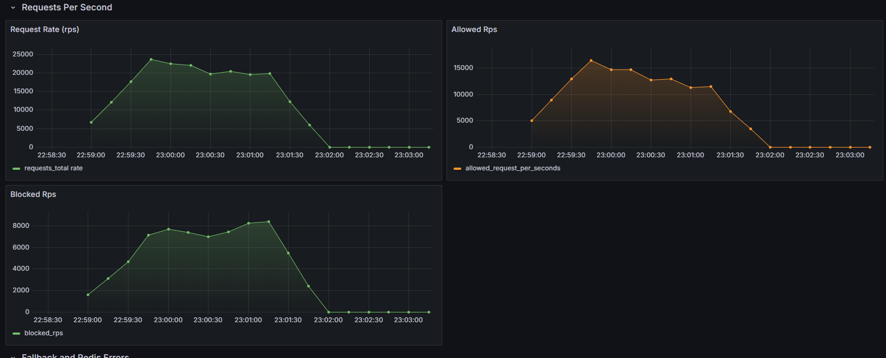
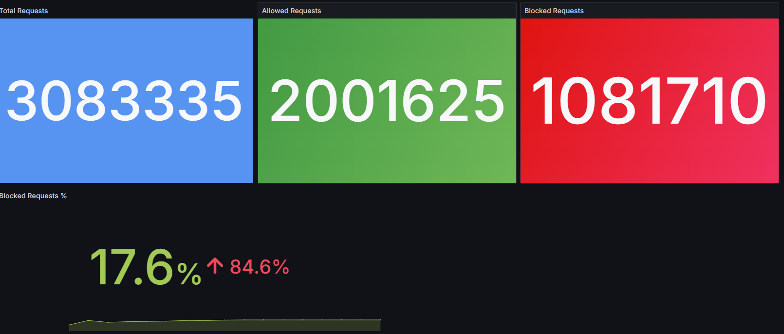
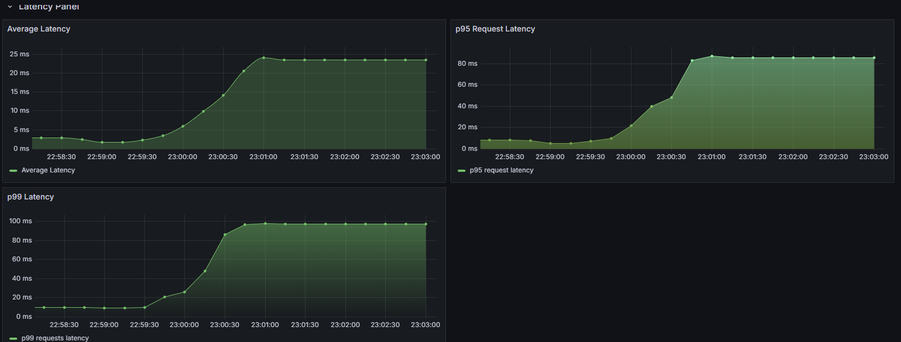
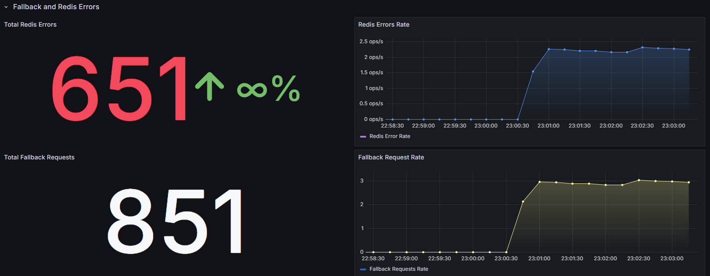

# Distributed Rate Limiter

<p align="center">
  
</p>

A per-IP rate limiter written in Go. Redis holds the token-bucket state and the
check-and-decrement runs inside a single Lua script so concurrent requests for the
same key can't race. The interesting part isn't the happy path. It's what happens
when Redis slows down or disappears. A circuit breaker and an in-memory fallback
keep the service answering requests instead of failing with it.

Stress tested to ~24.7k req/s and 3M+ requests, staying available the whole time
Redis was degraded under load.

## Architecture

Every request passes through the limiter middleware, which derives the client key
from `X-Forwarded-For` (falling back to `RemoteAddr`). The decision path depends on
whether Redis is currently considered healthy:

```
request → middleware → key = X-Forwarded-For
                          │
              RedisHealthy?├── yes ─→ EVAL Lua (atomic refill + decrement) ─→ allow / 429
                          │              │
                          │              └── error → failures++ → breaker opens at 3
                          │
                          └── no  ─→ in-memory token bucket ─→ allow / 429
```

The token bucket is the same algorithm on both paths: a bucket of `capacity` tokens
that refills at a fixed rate, one token spent per request. On the Redis path the
refill math, the bounds check and the decrement all happen in one `EVAL`, so there's
no read-modify-write window for two requests to both see the last token.

A background goroutine pings Redis every two seconds. When the circuit is open it's
what flips the service back to Redis once Redis recovers, so the fallback is never
sticky.

Defaults are set in [`cmd/server/main.go`](cmd/server/main.go):

| Setting | Value |
|---|---|
| Capacity (burst) | 10 tokens per IP |
| Refill rate | 10 tokens / 60s |
| Per-request limiter deadline | 100 ms |
| Redis dial / read / write timeout | 500 ms |
| Health check interval | 2 s |
| Breaker threshold | 3 consecutive failures |

## Features

Rate limiting is per-IP and distributed. State lives in Redis, so multiple
instances share one view of each client's budget. Multi-IP load is simulated through
the `X-Forwarded-For` header, which is also how a real deployment behind a proxy
would carry the client address.

Reliability is built around two mechanisms. The circuit breaker counts consecutive
Redis errors and opens after three, immediately routing traffic to the local limiter
instead of burning request deadlines on a Redis that isn't answering. The health
checker runs independently and closes the breaker again once Redis responds.

Operationally the service exposes a `/health` endpoint, emits structured JSON logs
through `slog`, and shuts down gracefully on `SIGINT`/`SIGTERM`. On signal it stops
accepting new connections, drains in-flight requests within a 10s deadline, then
closes the Redis connection.

## Performance Benchmarks

Measured locally with k6. The load test holds 200 VUs; the stress test ramps to 2000.

| | Multi-IP Load | Stress |
|---|---|---|
| Requests | 1.48M in 60s | 3.08M |
| Throughput | 24.7k req/s | 20.5k req/s |
| Avg latency | 8.0 ms | 35.9 ms |
| p95 latency | 12.9 ms | 92.2 ms |
| p99 latency | n/a | ~97 ms |
| Peak VUs | 200 | 2000 |
| Allowed | n/a | 2,001,625 |
| Blocked | ~34% | 1,081,710 |

The block rate is expected and is the point: with a 10-token bucket refilling at 10/min
per IP, sustained traffic from a fixed set of IPs is supposed to be throttled hard.

## Reliability & Failure Handling

Under the 2000-VU stress run, Redis started timing out and the breaker did its job:

| Signal | Observed |
|---|---|
| Redis errors | 651 |
| Fallback activations | 851 |
| Circuit breaker | opened under degradation, closed on recovery |
| Availability | service kept serving traffic throughout |

The flow under failure:

```
heavy load → Redis timeouts → breaker opens → fallback to in-memory limiter → traffic keeps flowing
```

The fallback isn't a perfect substitute. In-memory buckets are per-instance, so the
limit becomes approximate while the breaker is open. That's a deliberate trade: a
slightly looser limit beats dropping requests because the shared store is unreachable.

## Observability

Prometheus scrapes `/metrics` every 15s; Grafana renders the dashboards. Latency
percentiles are derived from a histogram, so p95/p99 come from `histogram_quantile`
rather than pre-aggregated numbers.

| Metric | Type | Meaning |
|---|---|---|
| `requests_total{status}` | counter | requests by outcome (`allowed`, `blocked`, `incoming`) |
| `requests_duration_seconds` | histogram | end-to-end request latency |
| `redis_errors_total` | counter | failed Redis operations |
| `fallback_request_total` | counter | requests served by the in-memory limiter |

## Running Locally

Everything comes up through Compose (app, Redis, Prometheus and Grafana):

```bash
docker compose up --build
```

Use `--build` after code changes; `docker compose up` on its own reuses the cached
image and won't pick up new source.

| Service | URL |
|---|---|
| Rate limiter | http://localhost:8080 |
| Metrics | http://localhost:8080/metrics |
| Health | http://localhost:8080/health |
| Prometheus | http://localhost:9090 |
| Grafana | http://localhost:3000 |

Redis runs with `maxmemory 512mb` and `allkeys-lru` eviction, so bucket keys are
bounded and old IPs are evicted under memory pressure instead of growing unbounded.

A quick manual check:

```bash
for i in $(seq 1 15); do curl -s -o /dev/null -w "%{http_code}\n" \
  -H "X-Forwarded-For: 1.2.3.4" http://localhost:8080/; done
```

The first ~10 return `200`, the rest `429` as the bucket empties.

## Load Testing

k6 scripts live in [`tests/`](tests/):

```bash
k6 run tests/load_test.js     # 200 VUs, 1 minute, p95 < 100ms threshold
k6 run tests/stress_test.js   # staged ramp 200 → 2000 VUs
```

Both generate a spread of synthetic IPs via `X-Forwarded-For` so the run actually
exercises many buckets rather than hammering one.

## Future Work

The limiter config is currently hardcoded in `main.go` and should move to env/flags.
`/health` is liveness only. A `/readyz` that reflects Redis state would make this
deployable behind an orchestrator. The breaker is a plain consecutive-failure counter;
a sliding window or half-open probe would be more precise. And the in-memory fallback
has no background sweeper wired in yet, so idle buckets aren't reclaimed until that's
hooked up.

## Screenshots

Grafana panels captured during a stress-test run, scraping Prometheus. Excuse the
rough dashboards.

### Requests per second



### Total requests



### Request latency



### Redis errors


